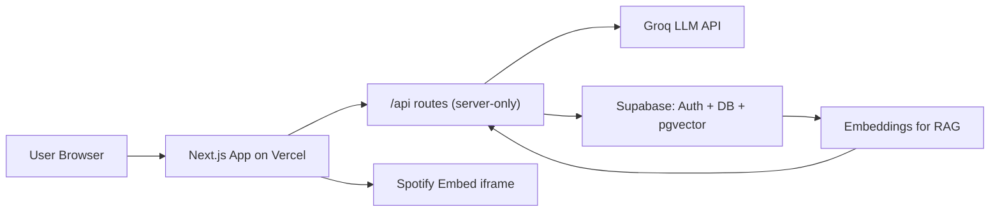

# Future Gadget Lab — Project Plan

> The build roadmap. For conventions and rules, see [`AGENTS.md`](./AGENTS.md).

---

## Concept

A unified "Future Gadget Lab" web experience hosting three interconnected anime-themed AI features. The entire site shares one cohesive aesthetic (CRT terminal, retro green-on-black, glitch effects, world line divergence meter in the header) so every feature reinforces the brand instead of feeling like three separate apps stitched together.

```
futuregadgetlab.app
├── /                  → Lab landing, world line meter, gadget cards
├── /d-mail            → D-Mail Terminal (Phase 1)
├── /amadeus           → Amadeus chat with Kurisu (Phase 2)
├── /lab-radio         → Themed playlists player (Phase 3)
└── /lab-notes         → "Lab Member" profile + saved history
```

---

## Tech Stack

- **Framework**: Next.js 15 (App Router) + TypeScript (strict)
- **Styling**: Tailwind CSS v4 + custom CRT/glitch theme + Framer Motion
- **Backend**: Next.js Route Handlers (no separate backend needed)
- **Auth + DB**: Supabase (auth, Postgres, pgvector for RAG)
- **LLM**: Groq API (Llama 3.3 70B) — free tier
- **Music**: Spotify Embed API or YouTube IFrame API (no copyright issues)
- **Hosting**: Vercel (free tier)
- **Repo**: GitHub public (open source for LinkedIn proof)

Full stack table with rationale: [`AGENTS.md`](./AGENTS.md) section 2.

---

## Architecture



API keys live ONLY in Next.js server routes — the browser never sees them. See [`AGENTS.md`](./AGENTS.md) section 4 for security rules.

---

## Phases at a Glance

| Phase | What | Timeline | Ships |
|---|---|---|---|
| 0 | Foundation (`AGENTS.md`, README, license, env, gitignore) | Done | This commit |
| 1 | D-Mail Terminal | Week 1-2 | MVP demo + LinkedIn post #1 |
| 2 | Amadeus chatbot + RAG | Week 3-4 | Deploy + LinkedIn post #2 |
| 3 | Lab Radio + Lab Notes | Week 5 | Final deploy + LinkedIn post #3 |

---

## Progress Log

| Phase | Status | Date | Notes |
|---|---|---|---|
| 0 — Foundation docs | Complete | 2026-05-14 | AGENTS.md, README, CONTRIBUTING, LICENSE, .env.example, .gitignore |
| 1.1 — Next.js scaffold + theme + landing | Complete | 2026-05-15 | See Phase 1.1 recap below |
| 1.2 — Groq backend + D-Mail API | Not started | — | Next up |
| 1.3 — D-Mail UI + Divergence Meter | Not started | — | |
| 1.4 — Supabase auth + storage | Not started | — | |
| 1.5 — Ship: deploy + LinkedIn post #1 | Not started | — | |

---

## Phase 0: Foundation Docs (Complete — 2026-05-14)

- [`AGENTS.md`](./AGENTS.md) — project contract for AI agents and humans
- [`README.md`](./README.md) — GitHub-facing overview
- [`CONTRIBUTING.md`](./CONTRIBUTING.md) — PR checklist + conventions
- [`LICENSE`](./LICENSE) — MIT + fan-project disclaimer
- [`.env.example`](./.env.example) — env template (Groq + Supabase)
- [`.gitignore`](./.gitignore) — secrets and build output excluded

## Phase 1.1: Scaffold + Theme + Landing (Complete — 2026-05-15)

### What was built

**Next.js scaffold:**
- Next.js 16.2.6 (latest stable) — App Router, TypeScript strict, Tailwind v4, ESLint, Turbopack
- Import alias `@/*` configured in `tsconfig.json`
- Project root `future-gadget-lab/` (npm-compliant lowercase name)

**Theme system:**
- [`constants/theme.ts`](./constants/theme.ts) — color tokens, motion config, canon worldline values
- [`styles/crt.css`](./styles/crt.css) — CRT frame, scanlines, flicker, glitch text, terminal cursor, phosphor glow
- [`app/globals.css`](./app/globals.css) — Tailwind v4 `@theme` mapping our tokens to utilities

**Fonts (via `next/font`):**
- VT323 → `--font-terminal` (D-Mail terminal output)
- Share Tech Mono → `--font-ui` (general UI)
- Orbitron → `--font-display` (headings)

**Layout & landing:**
- [`app/layout.tsx`](./app/layout.tsx) — root layout with FGL header + World Line Meter (`1.048596`) + "El Psy Kongroo" footer
- [`app/page.tsx`](./app/page.tsx) — landing page with glitchy "WELCOME TO THE LAB" heading
- [`components/WorldLineMeter.tsx`](./components/WorldLineMeter.tsx) — divergence readout
- [`components/GadgetCard.tsx`](./components/GadgetCard.tsx) — reusable card with CRT frame, status badges

### Quality gates passed
- `tsc --noEmit` — 0 errors
- `npm run lint` — 0 errors
- `npm run dev` — ready in 6s

### Status of the three gadget cards
- Card #001 — D-Mail Terminal: **IN DEVELOPMENT** (clickable, leads to 404 until Phase 1.3)
- Card #002 — Amadeus: **OFFLINE** (locked, Phase 2)
- Card #003 — Lab Radio: **OFFLINE** (locked, Phase 3)

---

## Phase 1: D-Mail Terminal (Ship First — Week 1-2)

The core killer feature. Ship this alone if needed; it's the LinkedIn-worthy demo.

### User Flow
1. User types a "past event" they want to change (e.g., "I didn't go to that interview")
2. Composes a "D-Mail" (max 36 chars, like the show)
3. AI generates 3 divergent timelines with a **World Line Divergence Meter** value
4. Each timeline has a story, a divergence number, and a "Reading Steiner" memory flag
5. Save to "Lab Notes" if logged in; `localStorage` if guest

### Key Files
- `app/d-mail/page.tsx` — terminal-style UI
- `app/api/d-mail/route.ts` — Groq call with structured JSON output
- `components/DivergenceMeter.tsx` — animated number display
- `lib/groq.ts` — Groq client wrapper
- `lib/prompts/dmail.ts` — system prompt + Zod schema
- `supabase/migrations/001_timelines.sql` — timeline storage table

### LLM Strategy
Force JSON output via Groq's `response_format: { type: "json_object" }`. Validate with Zod schema:

```ts
{
  timelines: [
    { divergence: number, summary: string, fullStory: string, readingSteinerNote: string },
    // ...exactly 3 timelines
  ]
}
```

### Phase 1 Todos
- [x] **1.1** Next.js + TS + Tailwind scaffold, theme tokens, CRT styling, base layout with world line meter — *2026-05-15*
- [ ] **1.2** Groq client wrapper, D-Mail API route with structured JSON output, prompt engineering
- [ ] **1.3** D-Mail terminal page, divergence meter component, timeline result cards, localStorage save
- [ ] **1.4** Supabase project setup, magic link auth, timelines table, guest-to-user migration
- [ ] **1.5** Vercel deploy, README with demo GIF, LinkedIn post #1

---

## Phase 2: Amadeus (Week 3-4)

AI Kurisu Makise chatbot with persistent memory and lore-aware responses.

### Features
- Personality-locked system prompt (Kurisu's tsundere science energy)
- Conversation persists in Supabase (logged in) or `localStorage` (guest)
- **RAG over Steins;Gate lore**: curated lore corpus (characters, world lines, terms), embedded into Supabase pgvector
- Streaming responses for that "Amadeus is thinking" feel

### Key Files
- `app/amadeus/page.tsx` — chat UI with hologram avatar
- `app/api/amadeus/chat/route.ts` — RAG retrieval + Groq streaming
- `lib/rag/embed.ts` — embedding helper
- `lib/rag/retrieve.ts` — pgvector similarity search
- `supabase/migrations/002_amadeus.sql` — messages + lore_chunks tables
- `scripts/seed-lore.ts` — one-time script to populate lore embeddings

### Phase 2 Todos
- [ ] Amadeus chat page with hologram avatar, streaming message UI, conversation history
- [ ] Lore corpus curation, embedding script, pgvector setup, retrieval helper
- [ ] Streaming chat route with Kurisu system prompt + RAG context injection
- [ ] Deploy + technical writeup + LinkedIn post #2

---

## Phase 3: Lab Radio + Polish (Week 5)

Thematic music section — fits the universe, zero copyright risk.

### Features
- 3-4 curated playlists embedded from Spotify/YouTube:
  - "Lab Work" (lofi)
  - "El Psy Kongroo Focus" (Steins;Gate OST)
  - "Rainy Akihabara" (city pop / ambient)
- CRT monitor-styled player frame around the embed
- Persistent audio while navigating other gadgets (React context)

### Key Files
- `app/lab-radio/page.tsx` — playlist selector + embed
- `components/CrtFrame.tsx` — reusable CRT styling wrapper
- `components/PersistentAudio.tsx` — context provider
- `app/lab-notes/page.tsx` — user profile + saved history (integration pass)

### Phase 3 Todos
- [ ] Lab Radio page with curated Spotify/YouTube embeds, CRT frame, persistent audio context
- [ ] Lab Notes profile page, all-feature integration check, final aesthetic pass
- [ ] Final deploy + demo video + LinkedIn post #3 + technical deep-dives

---

## Cross-Cutting Concerns

### Aesthetic System (defined once, used everywhere)
- `constants/theme.ts` — colors (`#00FF41` terminal green, `#0A0A0F` black, `#FF003C` red alerts)
- `styles/crt.css` — scanline overlay, CRT flicker animation, glitch text
- Fonts: "VT323", "Share Tech Mono", "Orbitron" from Google Fonts via `next/font`

### Auth Flow (guest-first)
- Supabase Auth with magic link + Google OAuth
- Guest mode = full functionality, data in `localStorage`
- "Save to Lab Notes" CTA after each interaction nudges signup
- On signup, migrate `localStorage` data to Supabase

### Open-Source Readiness
- `.env.example` listing all required keys (already done)
- `README.md` with screenshots, demo GIF, 5-minute setup section (already done)
- `CONTRIBUTING.md` (already done)
- MIT License (already done)
- GitHub Actions for lint + typecheck (Phase 1)

---

## LinkedIn Posting Plan (the "2nd arrow")

Each phase = a separate LinkedIn post. Don't post once at the end — sustain reach across weeks.

- **After Phase 1**: "I built a Steins;Gate D-Mail simulator with AI" + demo GIF + GitHub link
- **After Phase 2**: "Added Amadeus — a Kurisu chatbot with RAG over the show's lore" + technical breakdown
- **After Phase 3**: "Final cut: Future Gadget Lab is live" + Vercel link + lessons learned
- **Bonus**: 2-3 technical deep-dive posts (RAG implementation, structured outputs, CRT styling)

Total: ~6 LinkedIn posts from one project.

---

## Deliberately NOT Including

- Mobile app version (web first, RN port later if it makes sense)
- Real-time multiplayer / shared timelines (scope creep)
- Payment / pro tiers (free side project, period)
- Custom music hosting (legal nightmare)
- Image generation for timelines (Phase 4 maybe; adds API cost)

---

## Risks & Mitigations

| Risk | Mitigation |
|---|---|
| Groq rate limits | 14,400 req/day is plenty; add per-IP rate limiting at the route handler |
| Supabase free tier limits | 500MB DB — text-only data, will last months/years |
| Copyright on Steins;Gate name/likeness | Clearly fan project, no monetization, no official assets — standard fan-project posture |
| Scope creep | Enforce 3-phase ship discipline ([`AGENTS.md`](./AGENTS.md) §9); resist mid-phase feature additions |
| Prompt drift across versions | Version every system prompt (`VERSION` const) per [`AGENTS.md`](./AGENTS.md) §6.5 |
| LLM hallucinated JSON | Zod validation on every response per [`AGENTS.md`](./AGENTS.md) §6.4 |

---

*This plan is a living document. Update it when you ship a phase. Never let it drift from reality.*

*El Psy Kongroo.*
