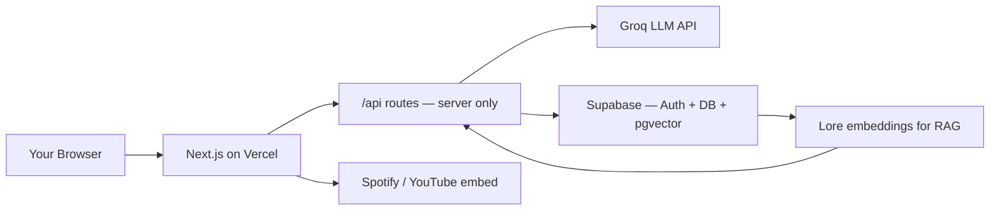

# Future Gadget Lab — Roadmap

> The living build plan. For coding rules and conventions, see [`AGENTS.md`](./AGENTS.md).
> For the current session state (what we're on right now), see [`CLAUDE.md`](./CLAUDE.md).

---

## What Are We Building?

A fan-made web app themed around the anime **Steins;Gate**. Three AI-powered "gadgets" live on one site, all sharing the same retro CRT terminal look — green text on black, glitch effects, scanlines, the whole thing.

```
futuregadgetlab.app
├── /              → Home — world line meter + three gadget cards
├── /amadeus       → Video-call chatbot with AI Kurisu Makise   (Phase 1)
├── /d-mail        → Send a message to your past self           (Phase 2)
├── /lab-radio     → Steins;Gate themed music player            (Phase 3)
└── /lab-notes     → Your saved history + profile               (Phase 3)
```

---

## Tech Stack

| What | Tool | Why we chose it |
|---|---|---|
| Framework | Next.js 16 (App Router) | Handles both the frontend and backend in one repo |
| Language | TypeScript (strict mode) | Catches mistakes before the code runs |
| Styling | Tailwind CSS v4 | Write styles as class names directly in the HTML |
| Animation | Framer Motion | Clean animations with minimal code |
| Auth + Database | Supabase | Free, handles login + stores our data |
| Vector Search | Supabase pgvector | Same database — stores AI embeddings for RAG |
| AI / LLM | Groq API (Llama 3.3 70B) | Free tier, very fast, same interface as OpenAI |
| Validation | Zod | Makes sure data is the right shape at runtime |
| Hosting | Vercel | Free, made for Next.js, auto-deploys on git push |

Full rationale: [`AGENTS.md`](./AGENTS.md) §2.

---

## How It Works (Architecture)



**The key rule:** API keys (Groq, Supabase service role) live ONLY on the server inside `/api` routes. The browser never sees them. See [`AGENTS.md`](./AGENTS.md) §4.

---

## Progress at a Glance

| Phase | What | Status |
|---|---|---|
| 0 | Foundation — docs, scaffold, theme, landing page | ✅ Done |
| 1 | Amadeus — Kurisu video-call chatbot | 🔄 In progress |
| 2 | D-Mail Terminal + Amadeus RAG upgrade | ⬜ Not started |
| 3 | Lab Radio + Lab Notes polish + final deploy | ⬜ Not started |

---

## Phase 0: Foundation (Done — 2026-05-14)

Everything needed before writing a single feature.

| File | What it is |
|---|---|
| `AGENTS.md` | The rules file — every contributor (human or AI) follows this |
| `README.md` | The public-facing GitHub page |
| `CONTRIBUTING.md` | How to submit a PR |
| `LICENSE` | MIT open-source license |
| `.env.example` | Template showing which API keys are needed |
| `.gitignore` | Tells git to never commit secrets or build files |

---

## Phase 1: Amadeus — Kurisu Video-Call Chatbot

**The goal:** `/amadeus` opens like a video call. You see a stylized avatar of Kurisu Makise, a "CONNECTING..." animation, then a chat where she responds as she does in the show — streamed word by word, with her personality fully intact.

### Subphases

#### 1.1 — Scaffold + Theme + Landing ✅ Done (2026-05-15)

Built the skeleton of the entire site.

- Next.js 16.2.6 with TypeScript strict, Tailwind v4, ESLint, Turbopack
- `constants/theme.ts` — one place where all colours live (never hardcode hex in JSX)
- `styles/crt.css` — CRT scanlines, flicker, glitch text, phosphor glow
- Three fonts loaded via `next/font`: VT323 (terminal), Share Tech Mono (UI), Orbitron (headings)
- `app/layout.tsx` — the site shell: header with World Line Meter + "El Psy Kongroo" footer
- `app/page.tsx` — landing with three gadget cards
- `components/GadgetCard.tsx` + `WorldLineMeter.tsx`

Quality gates: `tsc` 0 errors · `eslint` 0 errors · `npm run dev` loads cleanly

---

#### 1.2 — Backend: Groq Client + Amadeus API Route + Kurisu Prompt ✅ Done (2026-06-08)

Built everything the server needs to talk to the AI.

- `lib/groq.ts` — single Groq client used everywhere (lazy init so build works without a key)
- `lib/prompts/amadeus.ts` — Kurisu's full personality prompt, Steins;Gate lore, canon spellings, versioned `1.0.0`
- `app/api/amadeus/chat/route.ts` — POST route that streams Kurisu's response back to the browser; Zod validates every incoming message
- `lib/supabase/server.ts` + `lib/supabase/client.ts` — Supabase clients (server and browser versions are separate for security)
- Dependencies installed: `groq-sdk`, `zod`, `framer-motion`, `@supabase/supabase-js`

Quality gates: `tsc` 0 errors · `eslint` 0 errors · `next build` succeeds without env keys

---

#### 1.3 — Frontend: Amadeus Video-Call UI ✅ Done (2026-06-08)

Built the page you actually see and interact with.

- `app/amadeus/page.tsx` — the full video-call interface:
  - Framer Motion entrance sequence: `CONNECTING...` → `AMADEUS SYSTEM ONLINE`
  - CSS geometric Kurisu avatar (no copyrighted art — rings + head/shoulder silhouette with purple glow)
  - Streaming chat with blinking cursor while Kurisu is "typing"
  - Send with Enter, Shift+Enter for newline
  - Conversation history auto-saved to `localStorage` (guest mode)
  - CLEAR SESSION button
- Landing page updated: Amadeus card is now **ONLINE** (clickable), D-Mail stays **IN DEVELOPMENT**

Quality gates: `tsc` 0 errors · `eslint` 0 errors · `next build` succeeds

---

#### 1.3a — Kurisu Prompt Overhaul v1.1.0 ✅ Done (2026-06-08)

Rewrote `lib/prompts/amadeus.ts` to match Kurisu's actual voice from the visual novel and anime.

- **Tsundere speech patterns** — "W-well...", "D-don't misunderstand!", "That's—" with `...` for hesitation
- **Christina denial** — every use of "Christina" or "Chris" triggers a loud, specific rejection
- **Intellectual excitement** — she speeds up mid-sentence on science topics, then catches herself
- **@channel secret** — anonymous handle "KuriGohan and Wampa", panics if exposed
- **Sarcasm register** — dry one-liners when users say something obvious or dumb
- **Personal vulnerability** — rare moments of genuine warmth slipping through the armor
- **Addressing rules** — Okabe is always "Okabe" (never "Rintaro"), fond of Mayuri, tolerates Daru
- **Response length rules** — 1-3 sentences casual, 3-5 sentences science, never walls of text
- **Hard constraints** — no emoji, no kaomoji, never breaks character, never mentions real AI companies
- Bumped `AMADEUS_PROMPT_VERSION` to `"1.1.0"`

---

#### 1.3b — Video-Call Layout + TTS Voice ✅ Done (2026-06-08)

Redesigned `/amadeus` to feel like an actual video call, not a chat window.

- **Layout** — `75 %` of viewport height is the video feed panel (avatar centred, full-width); `25 %` is a compact chat strip at the bottom
- **HUD overlays** — corner brackets, status bar (`● LIVE`), bottom strip (`VIKTOR CHONDRIA UNIV. · LAT 35.6°`)
- **Web Speech API TTS** — every completed Amadeus response is spoken aloud using the browser's best female voice (rate 0.92, pitch 1.15). `▶ VOICE ON/OFF` toggle in chat header
- **Speaking animations** — purple glow pulses around the avatar, animated sound bars + `SPEAKING` label appear below the name plate while TTS plays
- **PNG avatar** — replaced CSS geometric avatar with `/public/kurisu.png` (user-provided, AI-generated — no official art). Scan line sweeps over the image; vignette darkens edges; purple `drop-shadow` glow; speaking glow ring pulses when TTS is active
- **Session persistence (guest mode)** — conversation history saved to `localStorage` (key `amadeus_history_v1`, last 40 messages); restored on every page load via a `useState` lazy initializer. Supabase persistence wired in Step 1.4.

---

#### 1.3c — 3D Talking Avatar (React Three Fiber + VRM) ✅ Done (2026-06-08)

Replaced the static PNG avatar with a real-time 3D character that animates when Amadeus speaks.

- **Dependencies added** — `three`, `@react-three/fiber`, `@react-three/drei`, `@pixiv/three-vrm` (stack table in AGENTS.md updated)
- **VRM model** — `VRM1_Constraint_Twist_Sample.vrm` (CC BY 4.0, from Pixiv/three-vrm) saved to `public/kurisu.vrm`. Swap this file with any VRoid export — code needs no changes.
- **`components/AmadeusAvatar.tsx`** — R3F Canvas with transparent background (`gl={{ alpha: true }}`):
  - `VRMScene` — loads VRM via `useLoader(GLTFLoader, ..., VRMLoaderPlugin)`. Suspends until loaded; R3F caches by URL.
  - Mouth: `expressionManager.setValue("aa", ...)` oscillates at ~5 Hz while `isSpeaking === true`
  - Blink: idle blink every 3.5–6 s via refs (no re-renders), 180 ms cycle
  - `vrm.update(delta)` called every frame for spring bones + look-at
  - Camera at `[0, 1.45, 0.7]` + `CameraLookAt` component aims at head height; model offset `y = -1.45` for bust framing
  - Purple key light + blue-white fill; CRT vignette overlay matches the rest of the UI
- **`app/amadeus/page.tsx`** — `next/dynamic` with `ssr: false` imports the avatar (Three.js is browser-only); `<KurisuAvatar>` PNG component removed; `loadHistory` moved from orphaned function to `useState` lazy initializer (bug fix)

Quality gates: `tsc` 0 errors · `eslint` 0 errors · committed on `main`

---

#### 1.3e — Edge TTS Voice Upgrade ✅ Done (2026-06-08)

Replaced Web Speech API (generic browser voice) with Microsoft Edge TTS via `edge-tts-universal`.

- **New route** — `app/api/amadeus/tts/route.ts` — POST `{ text }` → `audio/mpeg`; rate-limited; Zod-validated
- **Voice** — `en-US-JennyNeural` — young female, natural intonation, closest free match to Kurisu's English VA profile
- **Playback** — `new Audio(blob)` via Web Audio API; blob URL revoked after playback ends (no memory leaks)
- **`isSpeaking`** state activates on actual audio play start, not on fetch start — avatar mouth animation now accurately tracks speech
- **Voice toggle** — stops audio via `audio.pause()` instead of the old `speechSynthesis.cancel()`
- **Future upgrade** — `Loke-60000/christina-TTS` (Qwen3-TTS 0.9B fine-tuned on Kurisu's English voice) wired in Phase 2 via Python sidecar. `/api/amadeus/tts` will proxy to `CHRISTINA_TTS_URL` when set, falling back to Edge TTS.

---

#### 1.4 — Supabase Auth + Message Storage ⬜ After 1.3e

Hook up real logins so conversation history persists in the database.

What we'll build:
- Supabase project setup (create project on supabase.com, copy keys into `.env.local`)
- `supabase/migrations/001_messages.sql` — messages table with Row Level Security (RLS = users can only see their own messages)
- Magic link login (Supabase sends a login link to email — no password needed)
- When a guest signs in, migrate their `localStorage` history into the database
- "Save to Lab Notes" prompt after each conversation nudges the user to sign up

What you'll learn:
- **SQL migrations** — how we version database changes so they're reproducible
- **Row Level Security (RLS)** — Supabase's way of making sure users can't read each other's data
- **Magic link auth** — a passwordless login pattern common in modern apps

---

#### 1.5 — Deploy + LinkedIn Post #1 ⬜ After 1.4

Ship it.

- Deploy to Vercel: connect GitHub repo → auto-deploy on every push to `main`
- Add env vars in Vercel dashboard (Groq key, Supabase keys)
- Record a short demo GIF of the Amadeus video call for the README
- LinkedIn post: "I built a Steins;Gate Amadeus chatbot with streaming AI" + demo GIF + GitHub link

---

## Phase 2: D-Mail Terminal + Amadeus RAG Upgrade (Week 3-4)

Two things in one phase because they share the same infrastructure (Supabase pgvector).

### D-Mail Terminal

**The goal:** You type something you wish you could change about your past. You compose a 36-character "D-Mail" (like in the show). The AI generates 3 alternative timelines, each with a new world line divergence number.

What we'll build:
- `app/d-mail/page.tsx` — retro terminal UI with 36-char counter
- `app/api/d-mail/route.ts` — Groq call that returns **structured JSON** (not prose — three exact timeline objects)
- `lib/prompts/dmail.ts` — D-Mail system prompt + Zod schema for the 3-timeline response
- `components/DivergenceMeter.tsx` — animated divergence number display
- `supabase/migrations/002_timelines.sql` — stores saved timelines with RLS

What you'll learn:
- **Structured JSON output from an LLM** — using `response_format: { type: "json_object" }` to force the model to return exact data shapes
- **Zod output validation** — why we validate the LLM's response before sending it to the client (the model can lie)

### Amadeus TTS Upgrade — Christina Voice

**The goal:** Replace Edge TTS (generic Microsoft voice) with `Loke-60000/christina-TTS` — a Qwen3-TTS 0.9B model fine-tuned on Kurisu's English voice. Free, no API key needed, runs locally with CUDA.

What we'll build:
- `python-sidecar/tts_server.py` — FastAPI server wrapping `qwen-tts`; listens on port 8001
- `python-sidecar/requirements.txt` — `qwen-tts`, `fastapi`, `uvicorn`
- Update `app/api/amadeus/tts/route.ts` — proxy to `CHRISTINA_TTS_URL` when env var is set; falls back to Edge TTS
- Vercel deployment: host sidecar on a separate VM or Modal.com (free tier covers ~1000 requests/day)

What you'll learn:
- **Python sidecar pattern** — running a separate Python service alongside a Node.js app
- **Graceful degradation** — how to fall back to a simpler solution when the primary service is unavailable
- **Model hosting** — how to expose a HuggingFace model as an HTTP API

Speaker to use: `christina` (ID 3000) for English. Credit: Loke-60000 on HuggingFace.

---

### Amadeus RAG Upgrade

**The goal:** Right now Kurisu's knowledge is baked into the system prompt. That works but doesn't scale. RAG (Retrieval-Augmented Generation) lets us store the lore in a database and pull only what's relevant per question.

What we'll build:
- `supabase/migrations/003_lore_chunks.sql` — stores Steins;Gate lore as text chunks with embeddings
- `scripts/seed-lore.ts` — one-time script to embed and upload the lore corpus
- `lib/rag/embed.ts` — converts text to a vector embedding via Groq
- `lib/rag/retrieve.ts` — searches pgvector for the top 4 most relevant lore chunks
- Update `app/api/amadeus/chat/route.ts` — inject retrieved chunks into each Kurisu response

What you'll learn:
- **Embeddings** — a way of turning text into numbers so a computer can measure how "similar" two pieces of text are
- **Vector search (pgvector)** — how Supabase finds the most relevant lore chunks for a given question
- **RAG pattern** — why this beats a huge system prompt (cheaper, more accurate, scalable)

---

## Phase 3: Lab Radio + Lab Notes + Final Polish (Week 5)

### Lab Radio

Curated music player themed around the show — zero copyright risk because we use embeds.

Playlists:
- "Lab Work" — lofi beats
- "El Psy Kongroo Focus" — Steins;Gate OST
- "Rainy Akihabara" — city pop / ambient

What we'll build:
- `app/lab-radio/page.tsx` — playlist selector + Spotify/YouTube embed in a CRT frame
- `components/PersistentAudio.tsx` — React context that keeps music playing as you navigate pages

### Lab Notes

The user's profile and saved history — pulls everything together.

- `app/lab-notes/page.tsx` — shows saved D-Mail timelines and Amadeus conversations
- Final aesthetic pass across all three gadgets

### Final Ship

- Full integration test across all features
- Demo video (longer than the Phase 1 GIF)
- LinkedIn post #3: "Future Gadget Lab is live — here's everything I built and learned"
- 2-3 technical deep-dive posts as bonus content:
  - How RAG works (with the actual code)
  - How streaming LLM responses work in Next.js
  - The CRT aesthetic system from scratch

---

## LinkedIn Plan

Each phase ships a LinkedIn post. Don't wait until the end — sustained posting builds more reach.

| After | Post idea |
|---|---|
| Phase 1 | "I built an AI Kurisu Makise video-call chatbot (Steins;Gate Amadeus)" + streaming demo GIF |
| Phase 2 | "Added D-Mail: send a message to your past self, AI generates 3 alternate timelines" + RAG breakdown |
| Phase 3 | "Future Gadget Lab is live — all 3 gadgets, full-stack, open source" + Vercel link |
| Bonus | 2-3 deep-dives on RAG, streaming, and the CRT design system |

Total: ~6 posts from one project.

---

## Deliberately Not Included

- Mobile app (web first; React Native port later if it makes sense)
- Real-time multiplayer / shared timelines (scope creep)
- Paid tiers (free side project, period)
- Custom music hosting (legal risk)
- AI image generation for timelines (interesting but adds cost; maybe Phase 4)

---

## Risks

| Risk | How we handle it |
|---|---|
| Groq rate limits | 14,400 free requests/day is plenty; per-IP rate limiter on every route |
| Supabase free tier | 500MB — text only, will last years |
| Steins;Gate copyright | Fan project, no monetization, no official art — standard fan-project posture |
| Scope creep | Phase discipline: finish current phase before starting the next |
| LLM returns bad JSON | Zod validates every structured response before it reaches the client |
| Prompt changes break things | Every system prompt has a `VERSION` constant — bump it on any change |

---

*Update this file whenever a subphase ships. Never let it drift from reality.*

*El Psy Kongroo.*
